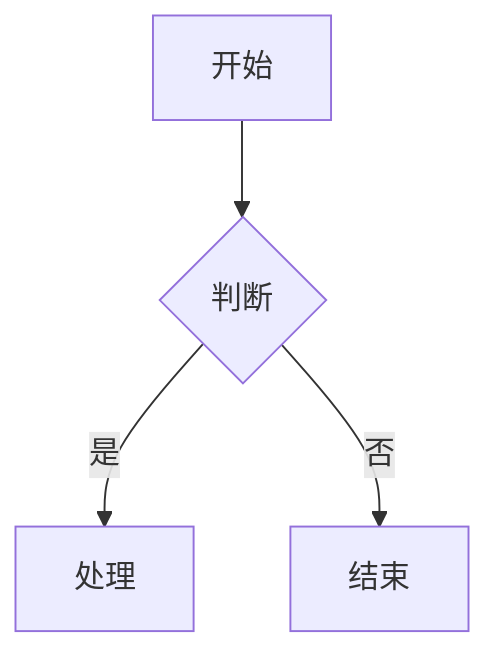

# Feishu Doc Maker

飞书文档制作技能，将内容转换为符合飞书格式规范的文档。

## 核心工作流

### 创建新文档（create-doc）

```json
{
  "title": "文档标题",
  "markdown": "Lark-flavored Markdown 内容",
  "folder_token": "可选：文件夹 token",
  "wiki_space": "可选：知识空间 ID"
}
```

**关键原则**：
- **不要在 markdown 开头重复一级标题** — title 参数已是标题，正文直接从正文内容开始
- **结构清晰** — 标题层级 ≤ 4 层，用 Callout 突出关键信息
- **视觉节奏** — 用分割线 `---`、分栏、表格打破大段纯文字
- **图文并茂** — 流程图、架构图优先用 Mermaid 可视化
- **克制留白** — Callout 不过度、加粗只强调核心词

### 更新现有文档（update-doc）

**优先使用局部更新，慎用 overwrite（全量重写可能丢失图片、评论）**：

| 模式 | 说明 | 使用场景 |
|------|------|----------|
| `append` | 追加到末尾 | 添加新章节 |
| `replace_range` | 定位替换 | 修改特定内容 |
| `insert_before` | 前插入 | 在指定内容前添加 |
| `insert_after` | 后插入 | 在指定内容后添加 |
| `delete_range` | 删除内容 | 移除不需要的部分 |
| `replace_all` | 全文替换 | 批量替换多处 |
| `overwrite` | 完全覆盖 | ⚠️ 慎用，会丢失媒体和评论 |

**定位方式**：
- `selection_with_ellipsis: "开头...结尾"` — 范围匹配
- `selection_by_title: "## 章节标题"` — 按标题定位

### 长文档分步创建

创建较长文档时，**建议先用 create-doc 创建基础结构，再用 update-doc 的 append 模式分段追加内容**，提高成功率。

## 格式速查

详见 [lark-markdown.md](references/lark-markdown.md)，以下为核心要点：

### 高亮块（最常用）

```html
<callout emoji="💡" background-color="light-blue">
关键提示内容
</callout>
```

常用：💡 light-blue(提示) ⚠️ light-yellow(警告) ❌ light-red(危险) ✅ light-green(成功)

### 分栏

```html
<grid cols="2">
<column>左栏</column>
<column>右栏</column>
</grid>
```

### Mermaid 图表（推荐）

````markdown

````

### 增强表格（复杂内容）

```html
<lark-table header-row="true">
<lark-tr>
<lark-td>

内容

</lark-td>
</lark-tr>
</lark-table>
```

## AI 写作规范

1. **结构先行** — 先规划标题结构，再填充内容
2. **格式丰富** — 合理使用 Callout、表格、分栏，避免纯文字堆砌
3. **图表优先** — 流程图、架构图用 Mermaid，比文字更直观
4. **层次清晰** — 标题 ≤ 4 层，避免过深嵌套
5. **重点突出** — 加粗只强调核心词，Callout 每页不超过 2 个
6. **保护媒体** — 替换内容时避开图片、画板等 token 区域
7. **增量更新** — 修改文档优先用 replace_range/append，慎用 overwrite

## 禁止事项

- ❌ 不要在 markdown 开头写与 title 相同的一级标题
- ❌ 不要用 overwrite 覆盖包含图片、评论的文档
- ❌ 图片不要用 token 属性，只用 url
- ❌ 表格单元格内容前后要空行
