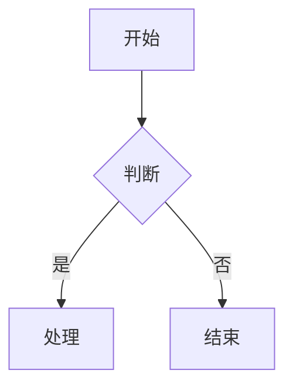

# Lark-Flavored Markdown 语法参考

## 基础格式

| 内容 | 语法 | 说明 |
|------|------|------|
| 标题 | `# H1` `## H2` ... | H1-H6 标准语法，H7-H9 用 `<h7>` 标签 |
| 加粗 | `**文字**` | 推荐使用 |
| 斜体 | `*文字*` | 可读性差，慎用 |
| 删除线 | `~~文字~~` | |
| 行内代码 | `` `code` `` | |
| 链接 | `[文字](URL)` | 不支持锚点 |
| 下划线 | `<u>文字</u>` | |

## 颜色和背景

| 内容 | 语法 |
|------|------|
| 文字颜色 | `<text color="red">文字</text>` |
| 文字背景 | `<text background-color="yellow">文字</text>` |

支持颜色：red, orange, yellow, green, blue, purple, gray

## 高亮块（Callout）

```html
<callout emoji="💡" background-color="light-blue">
内容
</callout>
```

- emoji：使用 emoji 字符如 ✅ ⚠️ 💡 🚀 ❌
- 背景色：light-red, light-blue, light-green, light-yellow, light-orange, light-purple, pale-gray

常用组合：
- 💡 light-blue：提示信息
- ⚠️ light-yellow：警告注意
- ❌ light-red：危险错误
- ✅ light-green：成功完成

## 分栏（Grid）

```html
<grid cols="2">
<column>

左栏内容

</column>
<column>

右栏内容

</column>
</grid>
```

- cols：2-5 列
- width：列宽百分比，总和为 100

三栏示例：
```html
<grid cols="3">
<column width="20">左(20%)</column>
<column width="60">中(60%)</column>
<column width="20">右(20%)</column>
</grid>
```

## 表格

### 标准 Markdown 表格

```markdown
| 列 1 | 列 2 | 列 3 |
|------|------|------|
| 内容 | 内容 | 内容 |
```

### 增强表格（单元格需要复杂内容时）

```html
<lark-table column-widths="200,250,280" header-row="true">
<lark-tr>
<lark-td>

**表头1**

</lark-td>
<lark-td>

**表头2**

</lark-td>
</lark-tr>
<lark-tr>
<lark-td>

普通文本

</lark-td>
<lark-td>

- 列表项1
- 列表项2

</lark-td>
</lark-tr>
</lark-table>
```

属性：
- `header-row`：首行是否为表头
- `column-widths`：列宽，像素值逗号分隔

## 提及

```html
<!-- 提及用户（需要先用 search_user 获取 open_id） -->
<mention-user id="ou_xxx"/>

<!-- 提及文档 -->
<mention-doc token="doxcnXXX" type="docx">文档标题</mention-doc>
```

## 图片

```html
<image url="https://example.com/img.png" width="800" align="center" caption="图片描述"/>
```

⚠️ 不支持 `token` 属性，只支持 `url`。系统会自动下载并上传。

## Mermaid 图表（推荐优先使用）

````markdown

````

支持类型：flowchart, sequenceDiagram, classDiagram, stateDiagram, gantt, mindmap, erDiagram

常用图形语法：
- 圆角矩形：`[文字]`
- 矩形：`[文字]`
- 菱形：`{判断}`
- 箭头：`-->`

## 引用容器

```html
<quote-container>
引用内容
</quote-container>
```

与 `>` 引用块不同，这是容器类型，可包含多个子块。

## 折叠块（用户手动创建，AI 一般用 Callout）

飞书编辑器输入 `[[fold` 可创建折叠块。AI 创建文档时建议用 Callout 代替。

## 分割线

```markdown
---
```

## 待办列表

```markdown
- [ ] 待办事项
- [x] 已完成
```

## 数学公式

块级：
````markdown
$$
\int_{0}^{\infty} e^{-x^2} dx = \frac{\sqrt{\pi}}{2}
$$
````

行内：`$E = mc^2$`（`$` 前后需空格）

---

## 禁止事项

- ❌ 不要混用不同表格语法
- ❌ 不要在表格内使用 `<br/>` 换行
- ❌ 不要遗漏 `<lark-td>` 闭合标签
- ❌ 图片不要使用 `token` 属性，只用 `url`
- ❌ Callout 子块不支持代码块、表格、图片
- ❌ 不要在 markdown 开头重复一级标题（title 参数已经是标题）
